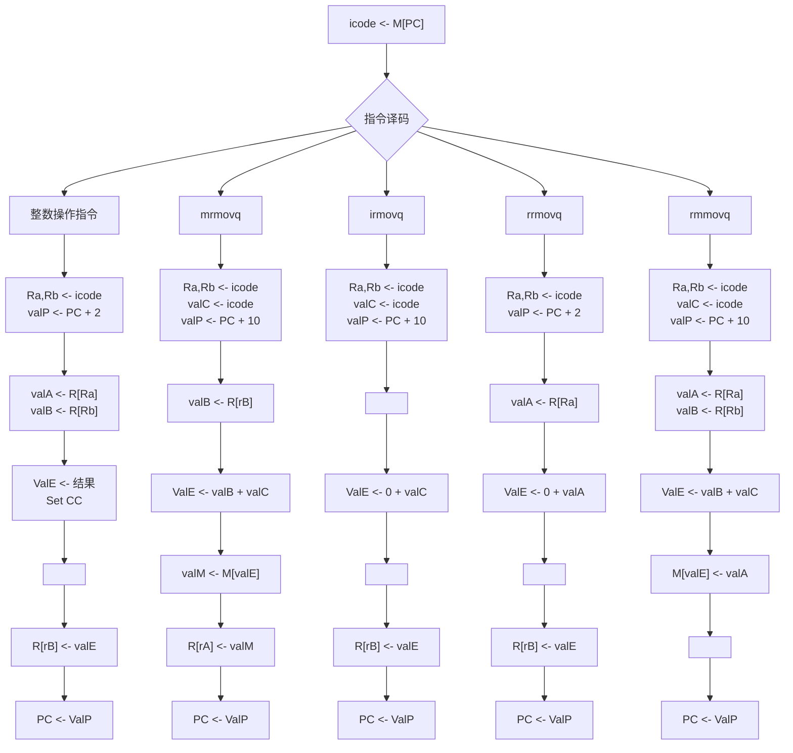
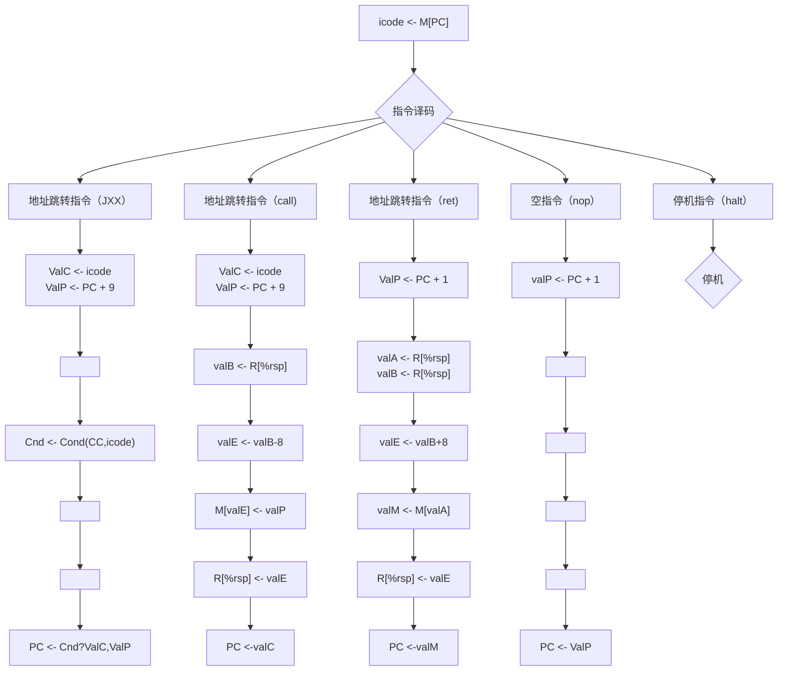

# 做一个自己的CPU--计组

用来记录计组的作业思路

## 系统综述

* 指令架构采取边长指令集

* 系统指针长度为64位

* 用1byte寻址

* 有15个寄存器，分别为 $ r_1 - r_{14} $ 以及 $ rsp$ ，用4bit寻址

* 指令格式

  * A: [op] 占1字节
  * B: [op]:[ra]:[rb] 占2字节

  * C: [op]:[ra]:[rb]:[val] 占10字节
  * D: [op]:[val] 占9字节

## 1. 指令系统

| 类型         | 格式 | 指令   | OP   | 语法            | 意义               |
| ------------ | ---- | ------ | ---- | --------------- | ------------------ |
| 停机指令     | A    | halt   | 00   | halt            | 停机               |
| 空指令       | A    | nop    | 10   | nop             | 空                 |
| 数据移动指令 | C    | irmovq | 20   | irmovq $x,Rb    | 立即数移动到寄存器 |
|              | B    | rrmovq | 30   | rrmovq Ra,Rb    | 寄存器移动到寄存器 |
|              | C    | mrmovq | 40   | mrmovq x(Rb),Ra | 存储器移动到寄存器 |
|              | C    | rmmovq | 50   | rmmovq Ra,x(Rb) | 寄存器移动到存储器 |
| 整数操作指令 | B    | addq   | 61   | addq Ra,Rb      | 加法               |
|              | B    | subq   | 62   | subq Ra,Rb      | 减法               |
|              | B    | mulq   | 63   | mulq Ra,Rb      | 乘法               |
|              | B    | divq   | 64   | divq Ra,Rb      | 除法               |
|              | B    | andq   | 65   | andq Ra,Rb      | 与                 |
|              | B    | orq    | 66   | orq Ra,Rb       | 或                 |
|              | B    | xorq   | 67   | xorq Ra,Rb      | 异或               |
| 地址跳转指令 | D    | jmp    | 80   | jmp Dest        | 直接跳转           |
|              | D    | je     | 81   | ...             | 相等跳转           |
|              | D    | jne    | 82   | ...             | 不相等跳转         |
|              | D    | js     | 83   | ...             | 负数               |
|              | D    | jns    | 84   | ...             | 非负数             |
| 函数调用指令 | D    | call   | A0   | call Dest       |                    |
|              | A    | ret    | B0   | ret             |                    |

## 2. 数据通路图

## 3. 指令流程图

## 汇编器

* 用于将汇编语言转化成二进制代码，供verilog读写
* 使用rust的nom库编写