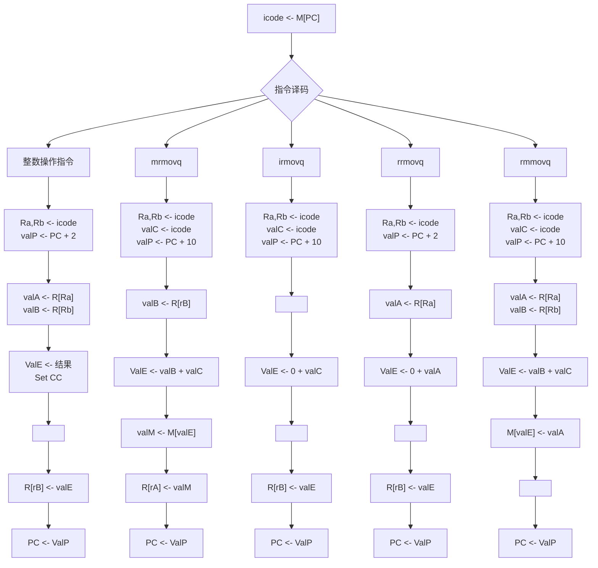
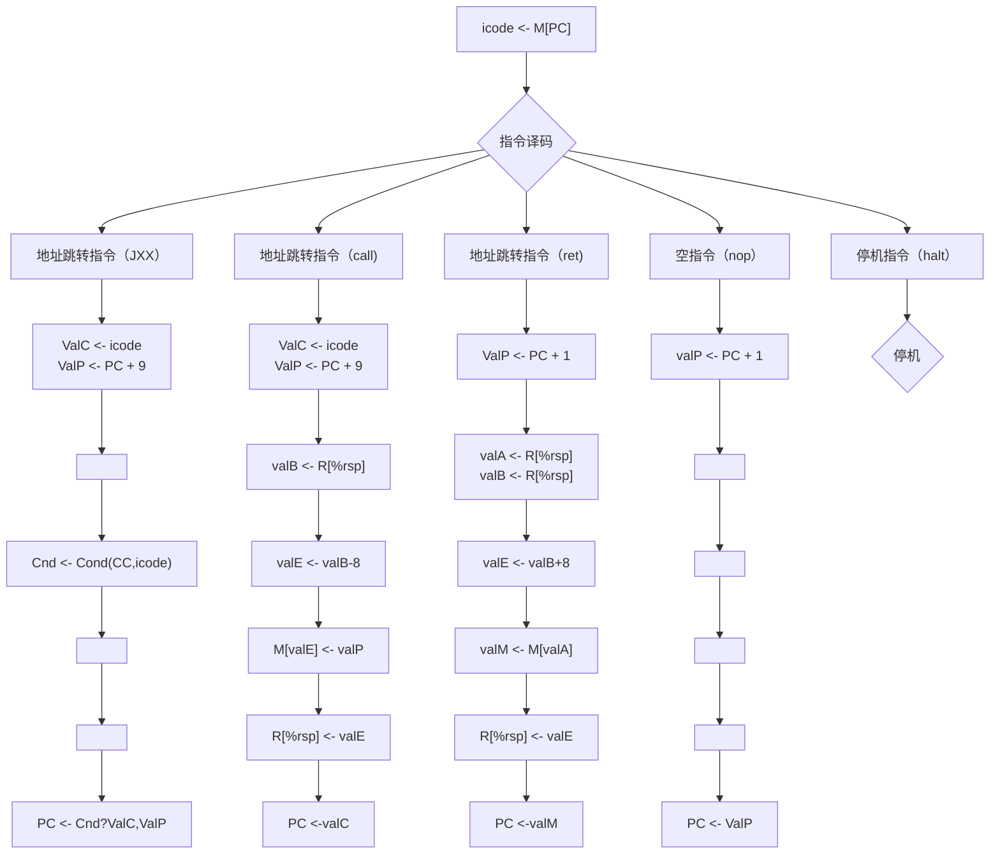

# 做一个自己的CPU--计组

用来记录计组的作业思路

## 系统需求

* 汇编器工具：Rust
* 仿真工具：Icarus Verilog
* 波形查看工具：GTKware

## 系统综述

* 指令架构采取变长指令集

* 系统指针长度为64位

* 用1byte寻址

* 有15个寄存器，分别为 $ r_1 - r_{14} $ 以及 $ rsp$ ，用4bit寻址

* 指令格式

  * A: [op] 占1字节
  * B: [op]:[ra]:[rb] 占2字节
* C: [op]:[ra]:[rb]:[val] 占10字节
  * D: [op]:[val] 占9字节

### Feature

* 类x86指令集

* 五级流水

## 1. 指令系统


| 类型         | 格式 | 指令   | OP   | 语法            | 意义               |
| ------------ | ---- | ------ | ---- | --------------- | ------------------ |
| 停机指令     | A    | halt   | 00   | halt            | 停机               |
| 空指令       | A    | nop    | 10   | nop             | 空                 |
| 数据移动指令 | C    | irmovq | 20   | irmovq $x,Rb    | 立即数移动到寄存器 |
|              | B    | rrmovq | 30   | rrmovq Ra,Rb    | 寄存器移动到寄存器 |
|              | C    | mrmovq | 40   | mrmovq x(Rb),Ra | 存储器移动到寄存器 |
|              | C    | rmmovq | 50   | rmmovq Ra,x(Rb) | 寄存器移动到存储器 |
| 整数操作指令 | B    | addq   | 61   | addq Ra,Rb      | 加法               |
|              | B    | subq   | 62   | subq Ra,Rb      | 减法               |
|              | B    | mulq   | 63   | mulq Ra,Rb      | 乘法               |
|              | B    | divq   | 64   | divq Ra,Rb      | 除法               |
|              | B    | andq   | 65   | andq Ra,Rb      | 与                 |
|              | B    | orq    | 66   | orq Ra,Rb       | 或                 |
|              | B    | xorq   | 67   | xorq Ra,Rb      | 异或               |
| 地址跳转指令 | D    | jmp    | 70   | jmp Dest        | 直接跳转           |
|              | D    | je     | 71   | ...             | 相等跳转           |
|              | D    | jne    | 72   | ...             | 不相等跳转         |
|              | D    | js     | 73   | ...             | 负数               |
|              | D    | jns    | 74   | ...             | 非负数             |
|              | D    | jg     | 75   | ...             | 大于（有符号）     |
|              | D    | jge    | 76   | ...             | 大于或等于         |
|              | D    | jl     | 77   | ...             | 小于               |
|              | D    | jle    | 78   | ...             | 小于或等于         |
|              | D    | ja     | 79   | ...             | 超过（无符号）     |
|              | D    | jae    | 7A   | ...             | 超过或相等         |
|              | D    | jb     | 7B   | ...             | 低于               |
|              | D    | jbe    | 7C   | ...             | 低于或相等         |
| 函数调用指令 | D    | call   | A0   | call Dest       |                    |
|              | A    | ret    | B0   | ret             |                    |

## 2. 数据通路图
.png)
## 3. 指令流程图




## 汇编器

* 用于将汇编语言转化成二进制代码，供verilog读写
* 使用rust的nom库编写


## 执行过程

* 使用汇编器将asm文件编译成二进制文件（Char里的数据为"hello world"的Ascii编码） 

``` assembly
    .pos 0
    irmovq Stack,%rsp
    call main
    halt
  main:
    irmovq Char,%r1
    irmovq NewChar,%r2
    irmovq $8,%r3
    irmovq $1,%r4
    irmovq $11,%r5
    orq %r5,%r5
    jmp test
  loop:
    mrmovq 0(%r1),%r6
    rmmovq %r6,0(%r2)
    addq %r3,%r1
    addq %r3,%r2
    subq %r4,%r5
  test:
    jne loop
    ret
    .pos 400
  Stack:
    .pos 600
  NewChar:
    .pos 800
  Char:
    .quad 104
    .quad 101
    .quad 108
    .quad 108
    .quad 111
    .quad 32
    .quad 119
    .quad 111
    .quad 114
    .quad 108
    .quad 100
```

* 将二进制文件喂给仿真程序（将其重命名为program.mem，并放到仿真目录下），得到：

``` shell
---------------------------------------------------
第  0个周期
---------------------------------------------------
第  1个周期
---------------------------------------------------
第  2个周期
[from Alu] %r15 from   0 to 400
[Mem] 0x                 392 to  19
---------------------------------------------------
第  3个周期
---------------------------------------------------
第  4个周期
[from Alu] %r15 from 400 to 392
[from Alu] %r1 from   0 to 600
---------------------------------------------------
第  5个周期
---------------------------------------------------
第  6个周期
[from Alu] %r2 from   0 to 680
[from Alu] %r3 from   0 to   8
---------------------------------------------------
第  7个周期
---------------------------------------------------
第  8个周期
[from Alu] %r4 from   0 to   1
[from Alu] %r5 from   0 to   5
---------------------------------------------------
第  9个周期
---------------------------------------------------
第 10个周期
[from Alu] %r5 from   5 to   5
---------------------------------------------------
第 11个周期
---------------------------------------------------
第 12个周期
[from Mem] %r6 from   0 to 104
---------------------------------------------------
第 13个周期
---------------------------------------------------
第 14个周期
[Mem] 0x                 680 to 104
[from Mem] %r7 from   0 to 100
[Mem] 0x                 600 to 100
---------------------------------------------------
第 15个周期
---------------------------------------------------
第 16个周期
[from Alu] %r1 from 600 to 608
---------------------------------------------------
第 17个周期
---------------------------------------------------
第 18个周期
[from Alu] %r2 from 680 to 672
[from Alu] %r5 from   5 to   4
---------------------------------------------------
第 19个周期
---------------------------------------------------
第 20个周期
[from Mem] %r6 from 104 to 101
---------------------------------------------------
第 21个周期
---------------------------------------------------
第 22个周期
[Mem] 0x                 672 to 101
[from Mem] %r7 from 100 to 108
[Mem] 0x                 608 to 108
---------------------------------------------------
第 23个周期
---------------------------------------------------
第 24个周期
[from Alu] %r1 from 608 to 616
---------------------------------------------------
第 25个周期
---------------------------------------------------
第 26个周期
[from Alu] %r2 from 672 to 664
[from Alu] %r5 from   4 to   3
---------------------------------------------------
第 27个周期
---------------------------------------------------
第 28个周期
[from Mem] %r6 from 101 to 108
---------------------------------------------------
第 29个周期
---------------------------------------------------
第 30个周期
[Mem] 0x                 664 to 108
[from Mem] %r7 from 108 to 114
[Mem] 0x                 616 to 114
---------------------------------------------------
第 31个周期
---------------------------------------------------
第 32个周期
[from Alu] %r1 from 616 to 624
---------------------------------------------------
第 33个周期
---------------------------------------------------
第 34个周期
[from Alu] %r2 from 664 to 656
[from Alu] %r5 from   3 to   2
---------------------------------------------------
第 35个周期
---------------------------------------------------
第 36个周期
[from Mem] %r6 from 108 to 108
---------------------------------------------------
第 37个周期
---------------------------------------------------
第 38个周期
[Mem] 0x                 656 to 108
[from Mem] %r7 from 114 to 111
[Mem] 0x                 624 to 111
---------------------------------------------------
第 39个周期
---------------------------------------------------
第 40个周期
[from Alu] %r1 from 624 to 632
---------------------------------------------------
第 41个周期
---------------------------------------------------
第 42个周期
[from Alu] %r2 from 656 to 648
[from Alu] %r5 from   2 to   1
---------------------------------------------------
第 43个周期
---------------------------------------------------
第 44个周期
[from Mem] %r6 from 108 to 111
---------------------------------------------------
第 45个周期
---------------------------------------------------
第 46个周期
[Mem] 0x                 648 to 111
[from Mem] %r7 from 111 to 119
[Mem] 0x                 632 to 119
---------------------------------------------------
第 47个周期
---------------------------------------------------
第 48个周期
[from Alu] %r1 from 632 to 640
---------------------------------------------------
第 49个周期
---------------------------------------------------
第 50个周期
[from Alu] %r2 from 648 to 640
[from Alu] %r5 from   1 to   0
---------------------------------------------------
第 51个周期
---------------------------------------------------
第 52个周期
---------------------------------------------------
第 53个周期
---------------------------------------------------
第 54个周期
[from Alu] %r15 from 392 to 400
---------------------------------------------------
第 55个周期
---------------------------------------------------
第 56个周期
服务器停机

```

## DEBUG模式

* 使用fpga-gdb来进行debug，将会打印出所有寄存器的值

``` shell
---------------------------------------------------
第  0个周期

取指阶段状态:
分支预测pc：0x                  10
是否暂停: 0
是否冒泡: 0

译码阶段状态: 0
指令： 2
ifun： 8
rA:  0
rB: 14
valP:                   10
valC:                  400
是否暂停: 0
是否冒泡: 0

执行阶段状态: 0
指令： 1
ifun：15
dstE: 15
dstM: 15
valA:                    0
valB:                    0
valC:                    0
cf: x
zf: x
sf: x
of: x
是否暂停: 0
是否冒泡: 0

访存阶段状态: 0
指令： 1
ifun：15
dstE: 15
dstM: 15
valA:                    0
valE:                    0
Cnd: x
是否暂停: 0
是否冒泡: 0

写回阶段状态: 0
指令： 1
dstE: 15
dstM: 15
valE:                    0
valM:                    0
是否暂停: 0
是否冒泡: 0

** VVP Stop(0) **
** Flushing output streams.
** Current simulation time is 3 ticks.
```

* 使用ls来列出所有寄存器

* 使用cont继续仿真

* 使用finish结束仿真

* 使用$display 来打印其余寄存器和网线的值

* 使用$deposit 来修改寄存器的值

  ## 参考

  * 《深入理解计算机系统》第四章