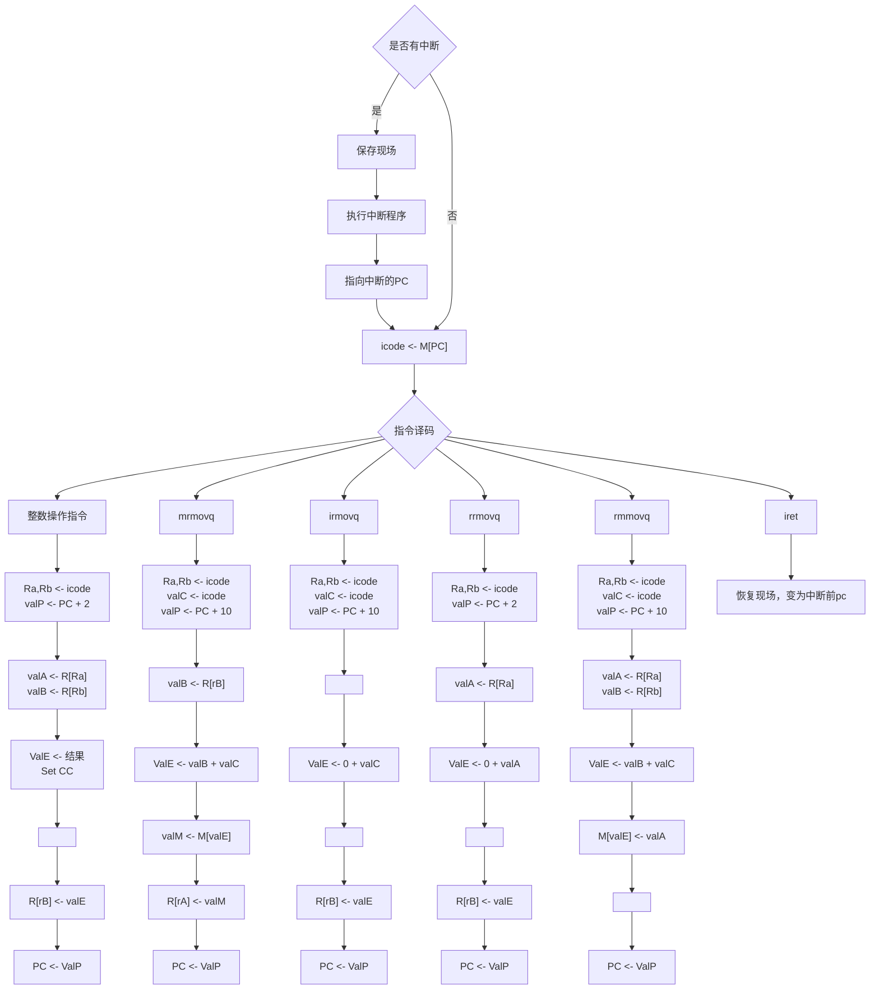
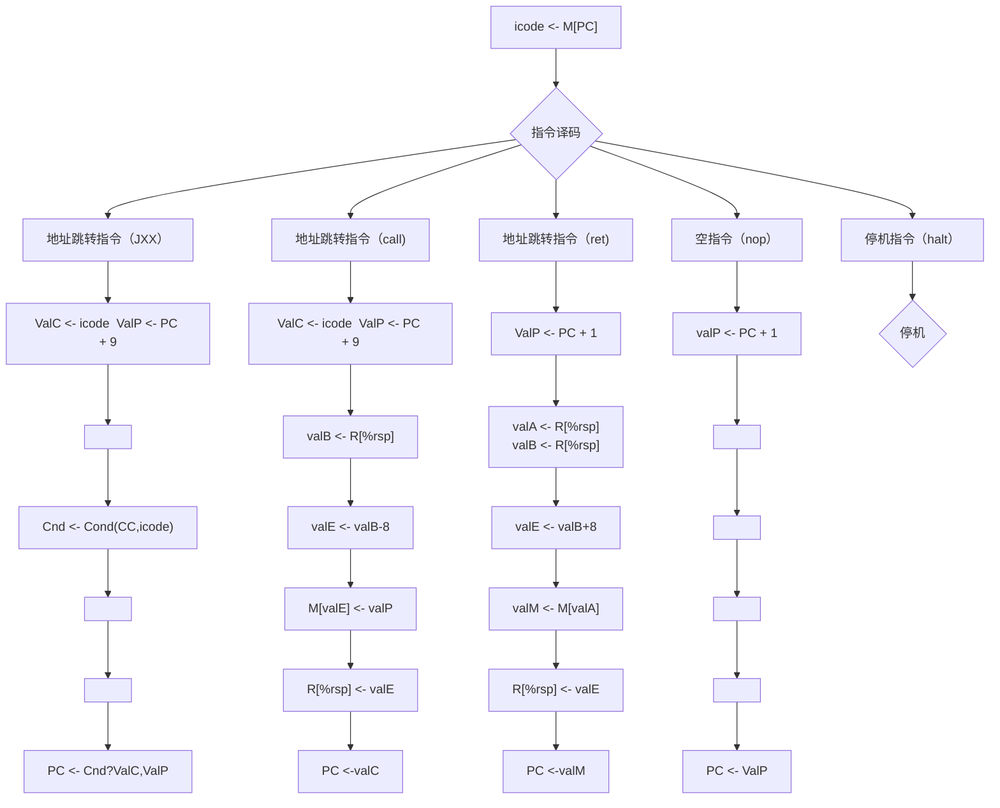

# 做一个自己的CPU--计组

用来记录计组的作业思路

## 系统需求

* 汇编器工具：Rust
* 仿真工具：Xilinx Vivado

## 系统综述

* 指令架构采取变长指令集

* 系统指针长度为64位

* 用1byte寻址

* 有15个寄存器，分别为 $ r_1 - r_{14} $ 以及 $ rsp$ ，用4bit寻址

* 指令格式

  * A: [op] 占1字节
  * B: [op]:[ra]:[rb] 占2字节
  * C: [op]:[ra]:[rb]:[val] 占10字节
  * D: [op]:[val] 占9字节

### Feature

* 类x86指令集

* 五级流水

### ALU模块

  * 提供基本的数据运算
  * 提供无符号数溢出，有符号数溢出，负数，为0信号
  * 

### 寄存器模块

* 提供数据备份，数据恢复

* 一个有１５个１６位寄存器

  ### 存储器模块

* 以byte为基础单位
* 提供一个16位读端口，一个32位读端口，一个16位写端口

## 1. 指令系统


| 类型         | 格式 | 指令   | OP   | 语法            | 意义               |
| ------------ | ---- | ------ | ---- | --------------- | ------------------ |
| 停机指令     | A    | halt   | 00   | halt            | 停机               |
| 空指令       | A    | nop    | 10   | nop             | 空                 |
| 数据移动指令 | C    | irmovq | 20   | irmovq $x,Rb    | 立即数移动到寄存器 |
|              | B    | rrmovq | 30   | rrmovq Ra,Rb    | 寄存器移动到寄存器 |
|              | C    | mrmovq | 40   | mrmovq x(Rb),Ra | 存储器移动到寄存器 |
|              | C    | rmmovq | 50   | rmmovq Ra,x(Rb) | 寄存器移动到存储器 |
| 整数操作指令 | B    | addq   | 61   | addq Ra,Rb      | 加法               |
|              | B    | subq   | 62   | subq Ra,Rb      | 减法               |
|              | B    | mulq   | 63   | mulq Ra,Rb      | 乘法               |
|              | B    | divq   | 64   | divq Ra,Rb      | 除法               |
|              | B    | andq   | 65   | andq Ra,Rb      | 与                 |
|              | B    | orq    | 66   | orq Ra,Rb       | 或                 |
|              | B    | xorq   | 67   | xorq Ra,Rb      | 异或               |
| 地址跳转指令 | D    | jmp    | 70   | jmp Dest        | 直接跳转           |
|              | D    | je     | 71   | ...             | 相等跳转           |
|              | D    | jne    | 72   | ...             | 不相等跳转         |
|              | D    | js     | 73   | ...             | 负数               |
|              | D    | jns    | 74   | ...             | 非负数             |
|              | D    | jg     | 75   | ...             | 大于（有符号）     |
|              | D    | jge    | 76   | ...             | 大于或等于         |
|              | D    | jl     | 77   | ...             | 小于               |
|              | D    | jle    | 78   | ...             | 小于或等于         |
|              | D    | ja     | 79   | ...             | 超过（无符号）     |
|              | D    | jae    | 7A   | ...             | 超过或相等         |
|              | D    | jb     | 7B   | ...             | 低于               |
|              | D    | jbe    | 7C   | ...             | 低于或相等         |
| 函数调用指令 | D    | call   | A0   | call Dest       |                    |
|              | A    | ret    | B0   | ret             |                    |
|              | A    | iret    | 80   | iret             | 中断返回                    |

## 2. 数据通路图
.png)
## 3. 指令流程图




## 汇编器

* 用于将汇编语言转化成二进制代码，供verilog读写
* 使用rust的nom库编写


## 执行过程

* 使用汇编器将asm文件编译成二进制文件 

``` assembly
   .pos 0
  irmovq Stack,%rsp
  out %rsp
  call main
  halt
main:
  irmovq $1,%r1
  irmovq $1,%r2
loopa:
  addq %r2,%r1
  jmp loopa
  ret
.pos 200
Stack:
.pos 300
interupt1:
  irmovq $400,%r1
  mrmovq 0(%r1),%r2
  irmovq $0,%r5
  subq %r5,%r2
  irmovq $2,%r5
  jmp testb
loopb:
  mrmovq 400(%r2),%r6
  subq %r5,%r2
  out %r6
testb:
  jne loopb
  iret
.pos 350
interupt2:
  irmovq $400,%r1
  irmovq $1024,%r5
  mrmovq 0(%r1),%r2
  mrmovq 0(%r5),%r4
  irmovq $2,%r3
  addq %r3,%r2
  rmmovq %r2,0(%r1)
  addq %r2,%r1
  rmmovq %r4,0(%r1)
  out %r4
  iret
```

### 仿真过程

* 执行仿真，模拟键盘输入的信号，将100,200,300键入，触发中断1，并最终触发中断2，倒序输出

``` verilog
  initial
    begin
      clk = 0;
      reset = 1;
      reset1 = 1;
      block = 0;
      interupt = 0;
      #100;
      reset1 = 0;
      #100;
      reset = 0;
      #300;
      keyboard_input = 100;
      interupt = 1;
      #30;
      interupt = 0;
      #1000;
       keyboard_input = 200;
       interupt = 1;
       #30;
       interupt = 0;
       #1000;
       keyboard_input = 300;
       interupt = 1;
       #30;
       interupt = 0;
       #1000;
       interupt = 2;
       #30;
       interupt = 0;
       #1000;
      $finish;
    end
  endmodule
```

  * 输出结果如下，倒序输出了300,200,100

``` shell
[Mem] 0x  192 to   9
[Mem] 0x  400 to   2
[Mem] 0x  402 to 100
[Mem] 0x  400 to   4
[Mem] 0x  404 to 200
[Mem] 0x  400 to   6
[Mem] 0x  406 to 300
  300
  200
  100

```

* 综合后仿真与布线后仿真结果相同，均为此输出

## DEBUG模式

* 打印出所有寄存器的值

``` shell
---------------------------------------------------
第  0个周期

取指阶段状态:
分支预测pc：0x                  10
是否暂停: 0
是否冒泡: 0

译码阶段状态: 0
指令： 2
ifun： 8
rA:  0
rB: 14
valP:                   10
valC:                  400
是否暂停: 0
是否冒泡: 0

执行阶段状态: 0
指令： 1
ifun：15
dstE: 15
dstM: 15
valA:                    0
valB:                    0
valC:                    0
cf: x
zf: x
sf: x
of: x
是否暂停: 0
是否冒泡: 0

访存阶段状态: 0
指令： 1
ifun：15
dstE: 15
dstM: 15
valA:                    0
valE:                    0
Cnd: x
是否暂停: 0
是否冒泡: 0

写回阶段状态: 0
指令： 1
dstE: 15
dstM: 15
valE:                    0
valM:                    0
是否暂停: 0
是否冒泡: 0

** VVP Stop(0) **
** Flushing output streams.
** Current simulation time is 3 ticks.
```

* 使用ls来列出所有寄存器
* 使用cont继续仿真
* 使用finish结束仿真
* 使用$display 来打印其余寄存器和网线的值
* 使用$deposit 来修改寄存器的值

## 总结

* 完善了流水线，加入了中断指令，使cpu可以保护现场，处理中断程序，恢复现场。
* 注意各种各样的坑，记得看warning，不要不把warning当回事。

## 参考

* 《深入理解计算机系统》第四章
